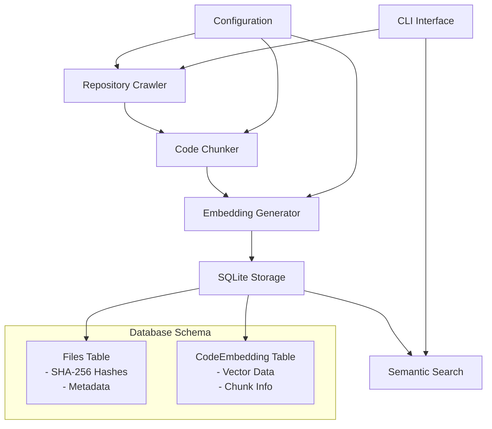

# Serena Code Embedding System

> **Overview**: Comprehensive guide to Serena's selective codebase embedding feature for semantic code search  
> **Audience**: Developers, Claude Code, and system administrators  
> **Last Updated**: August 2025

## What is Selective Codebase Embedding?

Serena's Code Embedding System enables **semantic search across your codebase without exposing full source code** in chat contexts. It intelligently chunks code files, creates vector embeddings, and provides natural language search capabilities while maintaining token efficiency.

### Key Benefits

- 🔍 **Semantic Code Discovery**: Find relevant code using natural language queries
- 🚀 **Token Efficiency**: Search code without exposing entire files in chat
- 📈 **Incremental Updates**: Only reprocess changed files using SHA-256 hashing
- 🧠 **Smart Chunking**: Structure-aware code splitting with overlap for context
- 🎯 **Language Awareness**: Specialized processing for Python, TypeScript, JavaScript

---

## Architecture Overview



### Core Components

1. **Repository Crawler**: Discovers code files using configurable glob patterns
2. **Code Chunker**: Splits files into 4KB chunks with smart boundary detection
3. **Embedding Generator**: Creates 384-dimensional vectors using MiniLM
4. **Database Layer**: Stores embeddings and metadata in SQLite with efficient indexing
5. **Search Engine**: Performs cosine similarity search across embedded chunks

---

## Quick Start

### 1. Index Your Codebase

```bash
# Index entire codebase
sara embed index

# Index specific files
sara embed index --files backend/app/models.py frontend/src/components/Auth.tsx

# Force reindex (ignore SHA-256 checksums)
sara embed index --force
```

### 2. Search Code Semantically

```bash
# Natural language code search
sara embed search "JWT token validation middleware"

# Find database-related code
sara embed search "SQLAlchemy models and relationships"

# Search for error handling patterns
sara embed search "exception handling try catch patterns"
```

### 3. Monitor Statistics

```bash
# View embedding metrics
sara embed stats
```

**Example Output:**
```
📊 Code Embedding Statistics:
   📁 Files indexed: 127
   🎯 Embeddings generated: 1,834
   📈 Average chunks per file: 14.4
```

---

## Configuration

### Environment Variables

Configure embedding behavior through environment variables:

```bash
# Core Embedding Settings
SARA_EMBEDDING_CHUNK_SIZE=4096          # Chunk size in bytes
SARA_EMBEDDING_OVERLAP_LINES=20         # Lines to overlap between chunks
SARA_EMBEDDING_STRIP_COMMENTS=true      # Remove comments before embedding

# File Selection Patterns (comma-separated globs)
SARA_EMBEDDING_INCLUDE_GLOBS="*.py,*.ts,*.tsx,*.js,*.jsx,backend/app/**/*.py,frontend/src/**/*.ts,frontend/src/**/*.tsx"

SARA_EMBEDDING_EXCLUDE_GLOBS="**/test*/**,**/tests/**,**/*test*,**/migrations/**,**/node_modules/**,**/.git/**,**/build/**,**/dist/**,**/__pycache__/**,**/*.pyc,**/*.min.js,**/*.map,**/coverage/**,**/.pytest_cache/**"
```

### Default File Patterns

**Included Files:**
- Python: `*.py`
- TypeScript: `*.ts`, `*.tsx`  
- JavaScript: `*.js`, `*.jsx`
- Backend code: `backend/app/**/*.py`
- Frontend code: `frontend/src/**/*.ts`, `frontend/src/**/*.tsx`

**Excluded Files:**
- Test files: `**/test*/**`, `**/tests/**`, `**/*test*`
- Build artifacts: `**/build/**`, `**/dist/**`, `**/*.min.js`
- Dependencies: `**/node_modules/**`, `**/__pycache__/**`
- Version control: `**/.git/**`
- Database migrations: `**/migrations/**`
- Coverage reports: `**/coverage/**`

---

## Technical Implementation

### Smart Code Chunking

The chunker implements several intelligent strategies:

#### Structure-Aware Splitting
- Detects function and class boundaries
- Preserves code context across chunks
- Avoids breaking mid-statement

#### Configurable Overlap
- Default 20-line overlap between chunks
- Maintains context for better semantic understanding
- Prevents information loss at chunk boundaries

#### Language-Specific Processing
- **Python**: Strips docstrings (`"""` and `'''`) and `#` comments
- **TypeScript/JavaScript**: Removes `/* */` multiline and `//` single-line comments
- **Generic**: Basic comment pattern removal for other languages

### Example Chunking Process

```python
# Input: large_file.py (500 lines)
# Output: Multiple chunks with metadata

{
    'chunk_id': 0,
    'start_line': 1,
    'end_line': 85,
    'content': '# Processed code content...',
    'content_preview': 'class UserModel: def __init__(self, username)...',
    'size_bytes': 3847
}
```

### Database Schema

#### Files Table
```sql
CREATE TABLE files (
    id INTEGER PRIMARY KEY,
    filepath TEXT NOT NULL UNIQUE,
    sha256 TEXT NOT NULL,
    kind TEXT DEFAULT 'code',
    file_size INTEGER,
    last_modified TIMESTAMP,
    start_line INTEGER DEFAULT 1,
    end_line INTEGER,
    created_at TIMESTAMP DEFAULT CURRENT_TIMESTAMP,
    updated_at TIMESTAMP DEFAULT CURRENT_TIMESTAMP
);
```

#### CodeEmbedding Table
```sql
CREATE TABLE code_embedding (
    id INTEGER PRIMARY KEY,
    file_id INTEGER NOT NULL,
    chunk_id INTEGER NOT NULL,
    start_line INTEGER NOT NULL,
    end_line INTEGER NOT NULL,
    vector BLOB NOT NULL,  -- 384-dimensional float32 array
    content_preview TEXT,
    created_at TIMESTAMP DEFAULT CURRENT_TIMESTAMP,
    FOREIGN KEY (file_id) REFERENCES files (id) ON DELETE CASCADE
);
```

### Incremental Updates

The system uses SHA-256 hashing for efficient change detection:

1. **Hash Calculation**: Computed from file content during indexing
2. **Change Detection**: Compare stored hash with current file hash
3. **Selective Processing**: Only reprocess files with changed hashes
4. **Force Override**: `--force` flag bypasses hash comparison

---

## Search Capabilities

### Semantic Similarity Search

The search engine uses cosine similarity to find relevant code chunks:

```python
# Example search query processing
query = "JWT token validation middleware"
query_vector = embedding_generator.generate_embedding(query)

# Cosine similarity calculation
similarity = dot_product(query_vector, chunk_vector) / (
    norm(query_vector) * norm(chunk_vector)
)
```

### Search Result Format

```bash
🔍 Searching codebase for: 'JWT token validation'

📊 Found 3 results:
────────────────────────────────────────────────────────────────────────────────

1. backend/app/utils/jwt.py:45-67
   📊 Similarity: 0.847
   💻 Preview: def validate_jwt_token(token: str) -> Optional[Dict]: | try: | payload = jwt.decode(token, key, algorithms=["RS256"])

2. backend/app/api/dependencies.py:12-28
   📊 Similarity: 0.723
   💻 Preview: async def get_current_user(token: str = Depends(oauth2_scheme)): | try: | payload = validate_jwt_token(token)

3. backend/app/middleware.py:89-115
   📊 Similarity: 0.681
   💻 Preview: class JWTMiddleware: | def __init__(self, app): | self.app = app | async def __call__(self, scope, receive, send):
```

---

## Performance Considerations

### Embedding Generation
- **Model**: `sentence-transformers/all-MiniLM-L6-v2` (80MB)
- **Dimensions**: 384 (optimal balance of performance and accuracy)
- **Speed**: ~30 seconds for 43 chunks (CPU-only)
- **Storage**: Efficient binary vector storage in SQLite

### Memory Usage
- **Vector Storage**: ~1.5KB per embedding (384 × 4 bytes)
- **Metadata**: Minimal overhead for chunk information
- **Database**: SQLite with WAL mode for concurrent access

### Scalability
- **Batch Processing**: Processes multiple files efficiently
- **Incremental Updates**: Only reprocesses changed files
- **Configurable Limits**: Customize chunk size and overlap for different codebases

---

## Best Practices

### Indexing Strategy

1. **Initial Setup**: Index entire codebase once
   ```bash
   sara embed index
   ```

2. **Regular Updates**: Run after significant changes
   ```bash
   sara embed index  # Only processes changed files
   ```

3. **Force Refresh**: When changing configuration
   ```bash
   sara embed index --force
   ```

### Search Optimization

1. **Be Specific**: Use domain-specific terms
   ```bash
   sara embed search "FastAPI dependency injection middleware"
   ```

2. **Include Context**: Mention frameworks or patterns
   ```bash
   sara embed search "SQLAlchemy async session management"
   ```

3. **Adjust Limits**: Customize result count based on needs
   ```bash
   sara embed search "error handling" --limit 20
   ```

### Configuration Tuning

1. **Chunk Size**: Larger chunks for more context, smaller for precision
2. **Overlap**: More overlap for better context preservation
3. **File Patterns**: Customize for your project structure
4. **Comment Stripping**: Disable for documentation-heavy code

---

## Troubleshooting

### Common Issues

#### No Results Found
```bash
sara embed stats  # Check if files are indexed
sara embed index --force  # Force reindex
```

#### Poor Search Quality
- Try different query terms
- Check if relevant files are indexed
- Verify file patterns include your code
- Consider adjusting chunk size

#### Performance Issues
- Reduce chunk size for faster processing
- Exclude large generated files
- Use specific file patterns instead of wildcards

### Debug Commands

```bash
# Check configuration
echo $SARA_EMBEDDING_CHUNK_SIZE
echo $SARA_EMBEDDING_INCLUDE_GLOBS

# Verbose indexing for debugging
sara embed index --verbose

# Check statistics
sara embed stats
```

---

## Integration Examples

### Claude Code Workflow

```bash
# 1. Index codebase for semantic search
sara embed index

# 2. Search for relevant patterns during development
sara embed search "authentication middleware patterns"

# 3. Find similar implementations
sara embed search "async database connection handling"
```

### Development Automation

```bash
#!/bin/bash
# Post-merge hook for automatic reindexing

echo "Updating code embeddings..."
sara embed index

if [ $? -eq 0 ]; then
    echo "✅ Code embeddings updated successfully"
else
    echo "❌ Failed to update embeddings"
    exit 1
fi
```

---

## Future Enhancements

### Planned Features
- **Git Hook Integration**: Automatic incremental updates on commit
- **FTS Hybrid Search**: Combine lexical and semantic search
- **Multiple Model Support**: Option to use different embedding models
- **Advanced Filtering**: Filter by file type, modification date, etc.
- **Export/Import**: Backup and restore embedding databases

### Configuration Improvements
- **Per-Project Settings**: Project-specific configuration files
- **Performance Profiles**: Optimized settings for different project sizes
- **Custom Patterns**: More flexible file selection rules

---

## API Reference

### Command Line Interface

All operations use the `sara embed` command with subcommands:

```bash
sara embed index [--force] [--files FILE1 FILE2...] [--project-root PATH] [-v]
sara embed search "query" [--limit N] [-v]
sara embed stats [-v]
```

### Configuration Schema

```python
class EmbeddingConfig:
    chunk_size: int = 4096
    overlap_lines: int = 20
    strip_comments: bool = True
    include_globs: List[str] = ["*.py", "*.ts", "*.tsx", "*.js", "*.jsx"]
    exclude_globs: List[str] = ["**/test*/**", "**/node_modules/**"]
```

---

## Security Considerations

- **Local Processing**: All operations happen locally, no data sent to external services
- **Read-Only Access**: Only reads source files, never modifies them
- **SHA-256 Integrity**: File integrity verification through cryptographic hashing
- **Configurable Exclusions**: Sensitive files can be excluded via patterns

---

**Built with ❤️ for the SmartWalletFX development team**